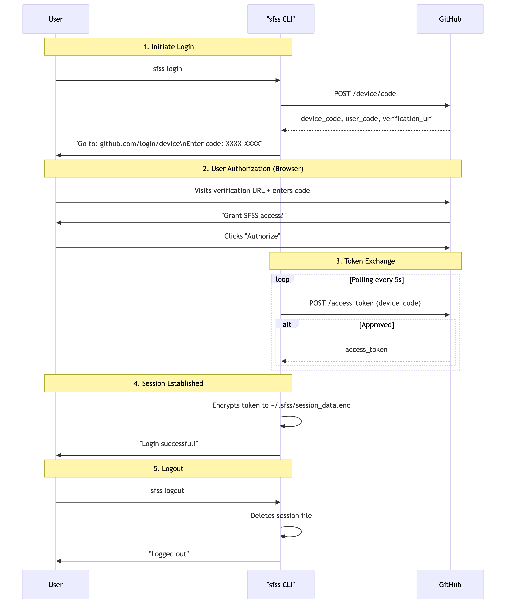
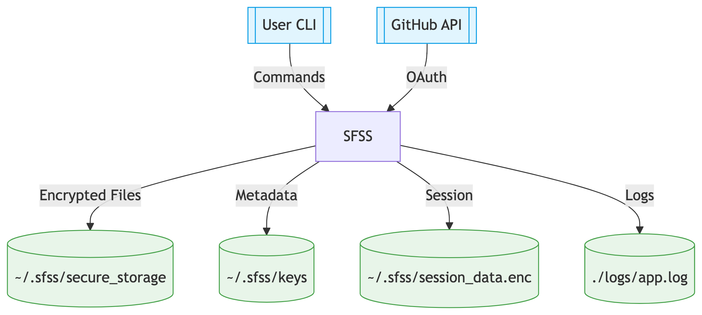
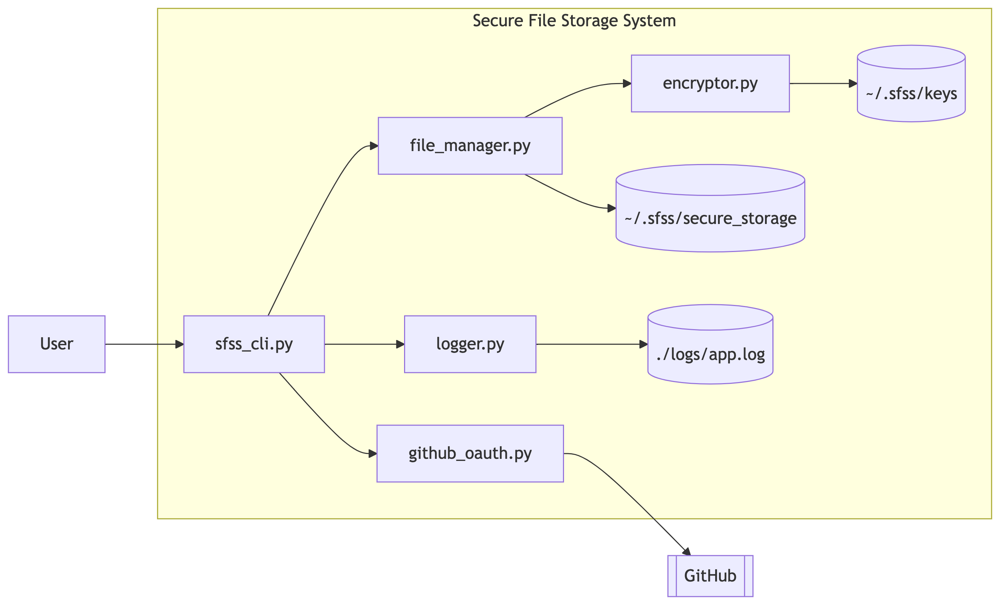
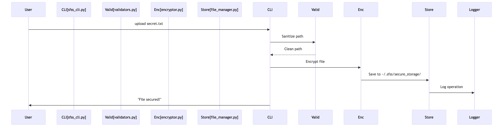

# **Secure File Storage System (SFSS) - Architecture Documentation**

## **Overview**

The **Secure File Storage System (SFSS)** is designed to provide a
highly secure and efficient mechanism for uploading, storing, and
retrieving files using AES-256 encryption and GitHub OAuth for
authentication. This document outlines the architectural design,
including:

-   **oAuth Flow** --- Overview of oAuth Github Authentication flow.

-   **High-Level Design (HLD)** --- Overview of core components.

-   **Low-Level Design (LLD)** --- Detailed breakdown of modules and interactions.

-   **Data Flow** --- Representation of data movement within the application.

## **OAuth Flow**
The OAuth Flow outlines how user authentication is handled via GitHub OAuth in the Secure File Storage System (SFSS). It ensures secure and seamless login while protecting sensitive data.

### **Flow Steps**
1.  **User Initiates Login**

    - The user triggers the sfss login command via the CLI.

    - The system redirects the user to the GitHub OAuth authorization page.

2.  **GitHub Authorization**

    - The user logs in with GitHub credentials.

    - GitHub prompts the user to grant permission to the SFSS application.

3.  **OAuth Token Exchange**

    - After successful authentication, GitHub redirects to the specified callback URL.

    - The authorization code is sent to the backend via a secure HTTPS request.

4. **Access Token Retrieval**

    - The system exchanges the authorization code for an access token.

    - The access token is stored securely in the user session.

5.  **Authenticated Session**

    - The system stores the token in a secure session.

    - Subsequent API requests are made using this token for authentication.

6. **Token Validation**

    - The token's validity is periodically checked.

    - If expired, the user is prompted to reauthenticate.

7. **Secure Logout**

    - The user logs out, and the session is invalidated.

    - The access token is securely wiped from the system.

**Diagram:** 

## **High-Level Design (HLD)**

The High-Level Design represents the major components of the SFSS and
their relationships. The primary components are:

1.  **Auth Service (GitHub OAuth)**

    -   Manages user authentication using OAuth 2.0.

    -   Issues tokens for session management.

2.  **Storage Service (AES-256 Encryption)**

    -   Handles file encryption, decryption, and storage.

    -   Ensures data is securely stored at rest.

3.  **File Manager**

    -   Facilitates operations like upload, download, list, and delete.

    -   Interfaces directly with encrypted storage.

4.  **Logger Service**

    -   Logs activities securely with sensitive data masking.

    -   Supports both audit and event logging.

5.  **Rate Limiter**

    -   Prevents abuse by limiting API calls.

**Diagram:** 
 

## **Low-Level Design (LLD)**

The Low-Level Design dives deeper into the implementation specifics of
each component:

### **Auth Service (src/auth/)**

-   github_oauth.py: Manages OAuth authentication.

-   token_manager.py: Generates and validates session tokens.

### **Storage Service (src/storage/)**

-   encryptor.py:

    -   encrypt_file(): Encrypts files using AES-256.

    -   decrypt_file(): Decrypts files for download.

-   file_manager.py:

    -   store_file(): Saves encrypted files.

    -   fetch_file(): Retrieves files for download.

### **File Manager (src/storage/file_manager.py)**

-   upload(): Encrypts and stores the file.

-   download(): Decrypts and retrieves the file.

-   list_files(): Lists all encrypted files.

-   delete_file(): Securely removes the file from storage.

### **Logger Service (src/utils/logger.py)**

-   log_event(): Records application events.

-   log_error(): Captures errors and exceptions.

### **Rate Limiter (src/utils/rate_limiter.py)**

-   check_rate_limit(): Validates API usage to prevent abuse.

**Diagram:** 

## **Data Flow**

The Data Flow diagram represents the sequence of operations for each
major feature of the SFSS:

### **File Upload Process**

1.  User authenticates using GitHub OAuth.

2.  CLI triggers the upload() command.

3.  File is encrypted with AES-256.

4.  Encrypted file is stored securely.

5.  Event is logged for auditing.

### **File Download Process**

1.  User requests the file via CLI.

2.  OAuth authentication is validated.

3.  File is decrypted and served to the user.

4.  Access event is logged securely.

### **File Deletion Process**

1.  User issues a delete command.

2.  OAuth session is verified.

3.  File is securely deleted from storage.

4.  Action is recorded in logs.

**Diagram:** 

## **Security Considerations**

-   OAuth 2.0 for secure authentication.

-   AES-256 for file encryption.

-   Masked logging for privacy.

-   Rate Limiting to prevent abuse.